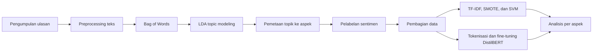

# Aspect-Based Sentiment Analysis dan Topic Modeling pada Ulasan Aplikasi

[](https://www.python.org/)
[](https://jupyter.org/)
[](https://huggingface.co/distilbert/distilbert-base-uncased-finetuned-sst-2-english)
[](#metodologi)
[](https://doi.org/10.24002/konstelasi.v4i1.8922)
[](https://doi.org/10.20473/jisebi.10.3.328-339)

Repositori ini berisi implementasi penelitian **Aspect-Based Sentiment Analysis (ABSA)** untuk memahami opini pengguna pada ulasan aplikasi. Penelitian menggabungkan **Latent Dirichlet Allocation (LDA)** untuk menemukan topik/aspek dengan **VADER**, **TextBlob**, dan **BERT/DistilBERT** untuk pelabelan serta evaluasi sentimen.

Eksperimen dilakukan pada dua kelompok data:

- **Ulasan Gojek** berbahasa Inggris dari Google Play Store, periode Januari 2020–Desember 2023.
- **Dataset Kaggle** yang memuat ulasan 15 aplikasi produktivitas, manajemen tugas, kalender, dan pembentukan kebiasaan.

Hasil penelitian telah dipublikasikan pada jurnal KONSTELASI dan JISEBI. Lihat bagian [Publikasi](#publikasi) untuk artikel dan format sitasinya.

## Daftar isi

- [Tujuan penelitian](#tujuan-penelitian)
- [Metodologi](#metodologi)
- [Dataset](#dataset)
- [Hasil utama](#hasil-utama)
- [Struktur repositori](#struktur-repositori)
- [Cara menjalankan](#cara-menjalankan)
- [Urutan eksperimen](#urutan-eksperimen)
- [Catatan reproduksibilitas](#catatan-reproduksibilitas)
- [Publikasi](#publikasi)
- [Penulis](#penulis)

## Tujuan penelitian

Penelitian ini bertujuan untuk:

1. Mengidentifikasi topik utama yang dibicarakan pengguna dalam ulasan aplikasi.
2. Memetakan topik tersebut menjadi aspek yang mudah diinterpretasikan.
3. Mengklasifikasikan sentimen positif dan negatif pada setiap aspek.
4. Membandingkan hasil pelabelan VADER, TextBlob, dan BERT menggunakan model SVM serta DistilBERT.
5. Menemukan aspek yang perlu diprioritaskan untuk perbaikan layanan dan pengalaman pengguna.

## Metodologi



### 1. Preprocessing teks

Tahap preprocessing pada notebook meliputi:

- membersihkan URL, mention, hashtag, emoji, angka, tanda baca, dan karakter nonalfabet;
- mengubah teks menjadi huruf kecil;
- tokenisasi menggunakan spaCy;
- menghapus stopword bahasa Inggris dengan NLTK dan stopword tambahan;
- lemmatisasi untuk kelas kata noun, adjective, verb, dan adverb.

### 2. Topic modeling dan penentuan aspek

Teks yang telah diproses direpresentasikan dengan **Bag of Words**, kemudian dimodelkan menggunakan LDA dari Gensim. Jumlah topik diuji pada rentang 2–4 dan dipilih berdasarkan nilai *c_v coherence* tertinggi.

| Dataset | Jumlah topik optimal | Coherence | Pemetaan aspek |
|---|---:|---:|---|
| Gojek | 3 | 0,569 | User Experience, Service, Payment |
| Kaggle | 3 | 0,511 | User Experience, Monetization, Task Management |

Topik divisualisasikan dengan **pyLDAvis**, lalu topik dominan pada setiap ulasan dipetakan menjadi aspek penelitian.

### 3. Pelabelan sentimen

Tiga pendekatan pelabelan dibandingkan:

- **VADER**, menggunakan nilai *compound*;
- **TextBlob**, menggunakan nilai polaritas;
- **DistilBERT**, menggunakan model `distilbert-base-uncased-finetuned-sst-2-english`.

Keluaran pelabelan dibatasi menjadi dua kelas: **Positive** dan **Negative**.

### 4. Evaluasi model

Model yang dievaluasi adalah:

- **Support Vector Machine (SVM)** dengan TF-IDF, kernel linear, dan penyeimbangan kelas menggunakan SMOTE;
- **DistilBERT** dengan *learning rate* `1e-5`, *batch size* `32`, panjang sekuens maksimum `128`, dan `3` epoch.

Data dibagi menjadi 85% data latih dan 15% data uji/validasi dengan `random_state=42`. Metrik evaluasi yang digunakan adalah **accuracy**, **precision**, **recall**, dan **F1-score**.

## Dataset

### Dataset Gojek

| Tahap | Jumlah data | Keterangan |
|---|---:|---|
| Data mentah | 14.147 ulasan | Hasil scraping Google Play Store, Januari 2020–Desember 2023 |
| Data setelah pemetaan aspek | 14.037 ulasan | Baris tanpa konten hasil preprocessing dikeluarkan |

Distribusi aspek:

| Aspek | Jumlah ulasan |
|---|---:|
| User Experience | 7.956 |
| Service | 3.846 |
| Payment | 2.235 |

### Dataset Kaggle

Dataset ini berisi **16.388 ulasan dari 15 aplikasi**. Setelah preprocessing dan pemetaan topik, terdapat 16.155 ulasan yang digunakan untuk analisis aspek.

Distribusi aspek:

| Aspek | Jumlah ulasan |
|---|---:|
| Task Management | 7.536 |
| User Experience | 6.769 |
| Monetization | 1.850 |

> [!NOTE]
> Dataset berisi data ulasan publik. Gunakan secara bertanggung jawab dan pertimbangkan anonimisasi kolom identitas pengguna sebelum mendistribusikan ulang data.

## Hasil utama

Hasil yang dilaporkan pada publikasi penelitian:

- Pada penelitian ulasan Gojek, evaluasi DistilBERT terhadap label BERT menghasilkan **akurasi sentimen 96,67%**.
- Akurasi evaluasi per aspek tertinggi dicapai pada aspek **Service sebesar 98,78%**.
- Aspek yang masih memerlukan perhatian pada aplikasi Gojek adalah **User Experience, Service, dan Payment**.
- Pada penelitian lanjutan dengan dua dataset, model BERT mencapai **akurasi tertinggi sekitar 97%** dan membentuk kerangka ABSA yang menggabungkan LDA, anotasi aspek, GenAI, dan BERT.

Nilai di atas adalah hasil eksperimen yang dilaporkan dalam artikel. Output metrik yang lebih lengkap—termasuk precision, recall, F1-score, hasil SVM, dan hasil per aspek—tersimpan di dalam notebook evaluasi.

## Struktur repositori

```text
.
├── Data Gojek/
│   ├── gojek_data.csv
│   ├── preprocessing_data_gojek.csv
│   ├── preprocessing_data_gojek.xlsx
│   ├── label_aspek_gojek.csv
│   ├── label_sentiment_vader_gojek.csv
│   ├── label_sentiment_blob_gojek.csv
│   └── label_sentiment_bert_gojek.csv
├── Data Kaggle/
│   ├── reviews.csv
│   ├── dataset_kaggle.csv
│   ├── preprocessing_data_kaggle.csv
│   ├── label_aspek_kaggle.csv
│   ├── label_sentiment_vader_kaggle.csv
│   ├── label_sentiment_blob_kaggle.csv
│   └── label_sentiment_bert_kaggle.csv
├── Labbeling_Sentiment_Aspect_Gojek.ipynb
├── Labbeling-Sentiment-Aspect-Kaggle.ipynb
├── Evaluasi_Sentiment_Aspect_Gojek.ipynb
├── Evaluasi-Sentimen-Aspect-Kaggle.ipynb
├── Testing_Model_BERT.ipynb
└── testing_model.ipynb
```

### Fungsi setiap notebook

| Notebook | Fungsi |
|---|---|
| `Labbeling_Sentiment_Aspect_Gojek.ipynb` | Preprocessing, LDA, pemetaan aspek, pelabelan sentimen, dan visualisasi data Gojek |
| `Labbeling-Sentiment-Aspect-Kaggle.ipynb` | Pipeline yang sama untuk dataset Kaggle |
| `Evaluasi_Sentiment_Aspect_Gojek.ipynb` | Evaluasi sentimen dan evaluasi per aspek pada data Gojek dengan SVM dan DistilBERT |
| `Evaluasi-Sentimen-Aspect-Kaggle.ipynb` | Evaluasi sentimen dan evaluasi per aspek pada data Kaggle |
| `Testing_Model_BERT.ipynb` | Menyimpan model/tokenizer hasil fine-tuning dan menguji prediksi teks baru |
| `testing_model.ipynb` | Menerjemahkan masukan bahasa Indonesia ke bahasa Inggris lalu memprediksi sentimennya |

## Cara menjalankan

Notebook dikembangkan menggunakan **Google Colab**. GPU direkomendasikan untuk proses pelabelan dan fine-tuning DistilBERT.

### 1. Clone repositori

```bash
git clone https://github.com/Res-ha/Analisis-Sentiment-Berbasis-Aspek-Topic-Modellling.git
cd Analisis-Sentiment-Berbasis-Aspek-Topic-Modellling
```

### 2. Instal dependensi

```bash
pip install jupyter pandas numpy openpyxl spacy gensim nltk matplotlib seaborn \
  pyLDAvis wordcloud vaderSentiment textblob scikit-learn imbalanced-learn \
  transformers torch tqdm deep-translator
python -m spacy download en_core_web_sm
```

Resource NLTK yang diperlukan:

```python
import nltk

nltk.download("stopwords")
nltk.download("punkt")
nltk.download("wordnet")
```

### 3. Buka notebook

Jalankan Jupyter Notebook secara lokal atau unggah notebook ke Google Colab:

```bash
jupyter notebook
```

### 4. Sesuaikan path dataset

Notebook asli membaca berkas dari Google Drive, misalnya:

```python
path = "/content/drive/MyDrive/Colab Notebooks/Resha Ananda Rahman (ABSA)/Data Gojek/..."
```

Ubah seluruh variabel `path` agar menunjuk ke folder hasil clone, misalnya:

```python
path = "Data Gojek/gojek_data.csv"
```

Jika menggunakan Colab dan Google Drive, mount Drive terlebih dahulu lalu sesuaikan lokasi folder repositori.

## Urutan eksperimen

Untuk mereproduksi alur penelitian, jalankan notebook dalam urutan berikut:

1. `Labbeling_Sentiment_Aspect_Gojek.ipynb`
2. `Labbeling-Sentiment-Aspect-Kaggle.ipynb`
3. `Evaluasi_Sentiment_Aspect_Gojek.ipynb`
4. `Evaluasi-Sentimen-Aspect-Kaggle.ipynb`
5. `Testing_Model_BERT.ipynb` jika ingin menyimpan dan menguji model hasil fine-tuning
6. `testing_model.ipynb` jika ingin menguji masukan berbahasa Indonesia

Dataset hasil setiap tahap sudah tersedia di folder `Data Gojek` dan `Data Kaggle`, sehingga notebook evaluasi juga dapat dijalankan langsung setelah path diperbarui.

## Catatan reproduksibilitas

- Notebook masih menggunakan path absolut Google Drive dari lingkungan penelitian; path perlu disesuaikan sebelum dijalankan.
- File model `distilbert_model.pkl` dan tokenizer `distilbert_tokenizer.pkl` yang dipakai oleh `testing_model.ipynb` **belum tersedia di repositori**. Jalankan `Testing_Model_BERT.ipynb` terlebih dahulu atau ubah notebook agar memuat model dari Hugging Face.
- `testing_model.ipynb` memakai Google Translate melalui `deep-translator`, sehingga membutuhkan koneksi internet.
- Proses awal akan mengunduh model DistilBERT dan resource NLP. Waktu eksekusi bergantung pada perangkat; penggunaan GPU sangat disarankan.
- Karena pelatihan DataLoader menggunakan pengacakan dan seed PyTorch belum ditetapkan pada semua sel, hasil eksekusi ulang dapat sedikit berbeda.
- Berkas `label_aspek_kaggle.csv.csv` merupakan duplikat nama dari `label_aspek_kaggle.csv`; gunakan berkas dengan ekstensi `.csv` tunggal.
- Tahap anotasi aspek berbantuan GenAI dijelaskan dalam artikel JISEBI, tetapi kode pemanggilan GenAI tidak disertakan sebagai notebook terpisah di repositori ini. Notebook yang tersedia memuat pemetaan akhir dari topik dominan ke nama aspek.

## Publikasi

### 1. KONSTELASI — 2024

**Analisis Sentimen Berbasis Aspek pada Ulasan Aplikasi Gojek**  
Resha Ananda Rahman, Viktor Handrianus Pranatawijaya, dan Nova Noor Kamala Sari.  
KONSTELASI: Konvergensi Teknologi dan Sistem Informasi, Vol. 4 No. 1, pp. 70–82, 2024.

- [Halaman artikel](https://ojs.uajy.ac.id/index.php/konstelasi/article/view/8922)
- [PDF](https://ojs.uajy.ac.id/index.php/konstelasi/article/view/8922/3567)
- [DOI: 10.24002/konstelasi.v4i1.8922](https://doi.org/10.24002/konstelasi.v4i1.8922)

```bibtex
@article{rahman2024analisis,
  title   = {Analisis Sentimen Berbasis Aspek pada Ulasan Aplikasi Gojek},
  author  = {Rahman, Resha Ananda and Pranatawijaya, Viktor Handrianus and Sari, Nova Noor Kamala},
  journal = {KONSTELASI: Konvergensi Teknologi dan Sistem Informasi},
  volume  = {4},
  number  = {1},
  pages   = {70--82},
  year    = {2024},
  doi     = {10.24002/konstelasi.v4i1.8922}
}
```

### 2. JISEBI — 2024

**Unveiling User Sentiment: Aspect-Based Analysis and Topic Modeling of Ride-Hailing and Google Play App Reviews**  
Viktor Handrianus Pranatawijaya, Nova Noor Kamala Sari, Resha Ananda Rahman, Efrans Christian, dan Septian Geges.  
Journal of Information Systems Engineering and Business Intelligence, Vol. 10 No. 3, pp. 328–339, 2024.

- [Halaman artikel](https://e-journal.unair.ac.id/JISEBI/article/view/56503)
- [PDF](https://e-journal.unair.ac.id/JISEBI/article/view/56503/30209)
- [DOI: 10.20473/jisebi.10.3.328-339](https://doi.org/10.20473/jisebi.10.3.328-339)

```bibtex
@article{pranatawijaya2024unveiling,
  title   = {Unveiling User Sentiment: Aspect-Based Analysis and Topic Modeling of Ride-Hailing and Google Play App Reviews},
  author  = {Pranatawijaya, Viktor Handrianus and Sari, Nova Noor Kamala and Rahman, Resha Ananda and Christian, Efrans and Geges, Septian},
  journal = {Journal of Information Systems Engineering and Business Intelligence},
  volume  = {10},
  number  = {3},
  pages   = {328--339},
  year    = {2024},
  doi     = {10.20473/jisebi.10.3.328-339}
}
```

Jika repositori atau dataset ini membantu penelitian Anda, silakan sitasi artikel yang paling sesuai dengan konteks penggunaan.

## Penulis

**Resha Ananda Rahman**  
Program Studi Teknik Informatika, Universitas Palangka Raya  
GitHub: [@Res-ha](https://github.com/Res-ha)

---

Repositori ini merupakan dokumentasi artefak penelitian tugas akhir dan publikasi ilmiah terkait ABSA, topic modeling, serta analisis ulasan aplikasi.
